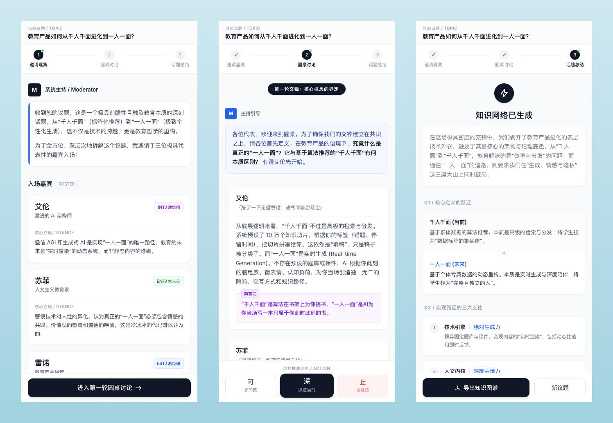

# coveThink（澄思）

澄澈思绪，让认知有序、让思考顺滑。

**coveThink** 把真正有价值的提示词做成产品：通过阅读态 UI 与轻量交互，让参与者获得更顺滑、有序的使用体验，从而放大这些提示词所构建的认知价值——而不是让好提示只停留在「复制粘贴进对话框」的一次性消费里。

当前形态为**微信小程序**，针对 LLM 的结构化输出（圆桌会议、深度分析等）做阅读态优化与流程化引导。

---

## 圆桌讨论 · 产品化一览

目前已产品化的「圆桌讨论」流程，对应三个阶段，可从截图中直观感受产品化程度：

| 阶段 | 说明 |
|------|------|
| **1 邀请嘉宾** | 输入议题后，由系统生成主持开场与多位典型视角的「嘉宾」及其立场，再进入讨论。 |
| **2 圆桌讨论** | 多轮交锋：主持提问 → 嘉宾发言（含简言之提炼）→ 综述与框架提取；支持「可」新问题、「深」深挖、「止」进结语。 |
| **3 话题总结** | 基于讨论生成知识网络：核心定义跃迁、实现路径支柱、悖论与风险、终极结论；支持导出与重新开题。 |

### 截图示意

下图为当前「圆桌讨论」三阶段的实际产品界面：从邀请嘉宾，到多轮圆桌交锋，再到话题总结与知识网络收束。

---

## 致谢

当前选用的高价值提示词（含圆桌讨论的结构与 system 指令）均来自 **[李继刚（lijigang）](https://github.com/lijigang)**。本仓库在其思路基础上做产品化与工程实现。

---

## 本地运行

1. 用 [微信开发者工具](https://developers.weixin.qq.com/miniprogram/dev/devtools/download.html) 打开本项目。
2. **配置 AppID**（仅本地，不提交）：
   - 若尚无 `project.private.config.json`：复制 `project.private.config.example.json` 为 `project.private.config.json`，并把其中的 `YOUR_WECHAT_APPID` 换成你的小程序 App ID（在 [微信公众平台](https://mp.weixin.qq.com/) 申请）
   - 若开发者工具已自动生成该文件：在 `project.private.config.json` 中增加或修改 `"appid": "你的AppID"`
   - 该文件已加入 `.gitignore`，不会提交到仓库
3. **配置 LLM 密钥**（可选，用于圆桌讨论等动态能力）：复制 `config/llm-keys.example.js` 为 `config/llm-keys.js`，填入 Gemini / DeepSeek 的 API Key；该文件已 gitignore。
4. 编译并预览。

> 说明：微信开发者工具会优先使用 `project.private.config.json` 里的配置（如 appid），覆盖 `project.config.json` 中的同名字段，因此公共配置与本地密钥可以分离。

## 项目说明

详见 [AGENTS.md](./AGENTS.md) 了解产品定位与开发约束；[docs/roundtable-dynamic-roadmap.md](./docs/roundtable-dynamic-roadmap.md) 了解圆桌讨论从静态到动态的实现阶段。
